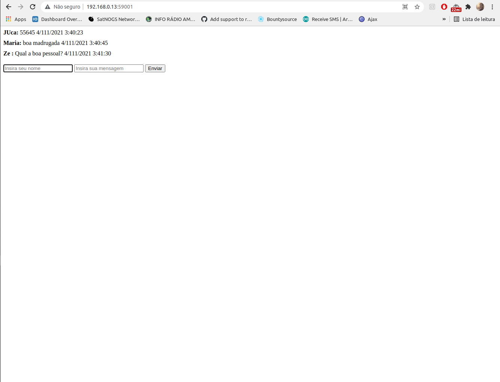

# chatPythonJS

<h4> TELA CHAT  </h4>

 Na tela de chat o usuario colocar seu nome e mensagem depois clicara em enviar. 

<ul>

<li> Mensagem sendo enviada via broadcast </li>
<li> Ainda sem banco ou seja mensagens sendo salvas em lista. </li>

</ul>

## 

